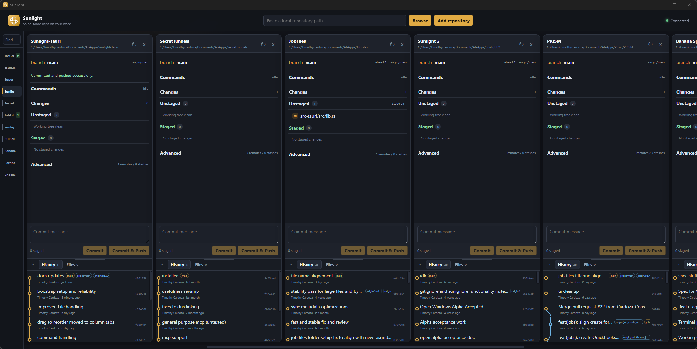

# Sunlight



A **local multi-repository Git desktop app**. Open several repos side by side, stage and commit, browse history and files, and keep a long-running command (for example `bun run dev`) alive in the same column.

This repository is the desktop app (Tauri 2 + Rust + SolidJS). It is not a hosted Git service.

> Status: **0.1.0**, early public preview. Expect sharp edges. Git operations run against your real working trees.

## Install

Download a build from [GitHub Releases](https://github.com/tim-of-course/Sunlight-Git/releases/latest) or the [project site](https://tim-of-course.github.io/Sunlight-Git/).

Install [Git](https://git-scm.com/downloads) first and make sure `git --version` works in a terminal. Sunlight uses your installed Git; it does not bundle it. Windows installations in `C:\Program Files\Git\cmd` are also detected. Repository commands require their own tools, such as Bun or Node.js.

- **Windows:** the NSIS installer (`.exe`). SmartScreen may warn until Authenticode signing is added; choose *More info* → *Run anyway*.
- **macOS (Apple Silicon):** the `.dmg` / `.app`. The build is ad-hoc signed so it should not appear as damaged. Allow it under System Settings → Privacy & Security.
- **Linux x64:** the AppImage (or `.deb` if present).

Sunlight checks for updates on launch and from the tray **Check for updates** item. It **asks before installing**. Installing an update quits the app (on Windows this is required by the installer), so save editor changes and stop running commands first if prompted.

## Why it exists

Most Git GUIs are one-repo-at-a-time. Sunlight is built for people who keep several local checkouts open: an app, a library, a docs repo, a sibling service. Each repository is a column. Git work and a process in that repo can happen together instead of forcing you into a separate terminal.

## Features

- **Multi-repo workspace** — add folders by path or Browse; reorder columns; recents persist across launches
- **Status and history** — staged / unstaged / untracked / conflicted files, branches, remotes, stashes, commit graph
- **Day-to-day Git** — stage, discard, commit, commit-and-push, fetch / pull / push, branch create / switch / track / rename / delete, stash, merge/rebase continue or abort
- **Diffs and a small editor** — inspect diffs, search and open files, save, or open in an external editor / Cursor
- **Per-repo commands** — run a shell command in that repository; stop it; handle common port conflicts
- **Local only** — uses the `git` on your machine; workspace list is stored on disk, not in the cloud

Adding a folder that is not yet a Git repository **initializes** one there.

## Development

Install these before the first run:

| Tool | Notes |
| --- | --- |
| [Git](https://git-scm.com/) | Must be on `PATH` (Windows: `C:\Program Files\Git\cmd` is also searched) |
| [Rust](https://rustup.rs/) | Stable toolchain; needed to compile the Tauri backend |
| [Bun](https://bun.sh/) | Frontend install and scripts |
| Platform toolchain | [Tauri 2 prerequisites](https://v2.tauri.app/start/prerequisites/) (MSVC Build Tools on Windows, Xcode CLT on macOS, webkit/gtk packages on Linux) |

```powershell
git clone https://github.com/tim-of-course/Sunlight-Git.git
cd Sunlight-Git
bun install
bun run tauri dev
```

On macOS or Linux the same commands work in any POSIX shell.

Then add repositories with **Browse** or by pasting a path. A command such as `bun run dev` can keep running while you stage, commit, and push in that column.

### Production build

```powershell
bun run tauri build
```

Installers land under `src-tauri/target/release/bundle/`. Signed updater artifacts also require the `TAURI_SIGNING_PRIVATE_KEY` environment variable.

## Test

```powershell
bun run test
bun run typecheck
cd src-tauri
cargo test
```

## Releasing

1. Bump the version in `package.json`, `src-tauri/tauri.conf.json`, and `src-tauri/Cargo.toml` to the **same** SemVer.
2. Commit, then tag `vX.Y.Z` matching that version and push the tag (or run the **publish** workflow).
3. The workflow opens a **draft** GitHub Release with installers and `latest.json`. Review the assets, then publish the release. Installed apps only see updates after the draft is published.

The publish workflow fails if a pushed tag does not match `v` plus the configured version.

### Updater signing

Updates are signed. The **public** key is in `src-tauri/tauri.conf.json`. The **private** key is a GitHub Actions secret named `TAURI_SIGNING_PRIVATE_KEY` (optional `TAURI_SIGNING_PRIVATE_KEY_PASSWORD`).

GitHub cannot show a secret after you save it. Keep an offline backup of the private key (this checkout uses the gitignored `.tauri-signing/` folder). If that key is lost, existing installs cannot receive updates.

## How it is put together

| Path | Role |
| --- | --- |
| `src/` | SolidJS UI (workspace, columns, diffs, editor, file browser) |
| `src-tauri/src/` | Rust backend: Git via subprocess, file I/O, per-repo command runner, workspace persistence |
| `src-tauri/tauri.conf.json` | Window, bundle, updater endpoint, and app identifier (`io.github.tim-of-course.sunlight`) |
| `website/` | GitHub Pages landing site |

The UI talks to Rust through Tauri commands (`git_op`, `run_command`, file APIs, workspace APIs). Git is never rewritten in-process; Sunlight shells out to `git` with timeouts and output limits. Installed apps check `https://github.com/tim-of-course/Sunlight-Git/releases/latest/download/latest.json` (a static file, not the GitHub REST API).

Workspace membership is saved to:

- Windows: `%LOCALAPPDATA%\Sunlight\workspace.json`
- macOS: `~/Library/Application Support/Sunlight/workspace.json`
- Linux: `$XDG_CONFIG_HOME/Sunlight/workspace.json` (or `~/.config/...`)

Override the file with `SUNLIGHT_WORKSPACE_FILE` if you need a custom location.

## License

[Apache License 2.0](LICENSE)
